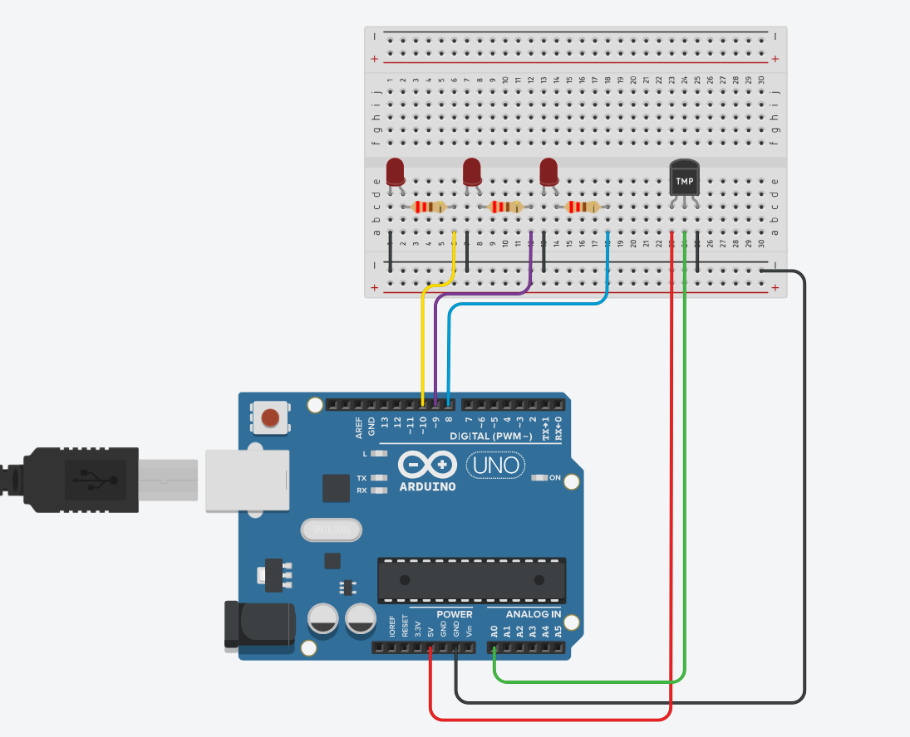

# Analog Temperature Logger (TMP36 + UART)

This project reads temperature values using a TMP36 analog sensor and outputs the results over the serial UART every second.

---

## 🎯 Functionality

- Reads analog voltage from TMP36 on pin `A0`
- Converts voltage to °C using the formula:
  

temperature = (voltage - 0.5) * 100

- Outputs voltage and temperature over `Serial` every 1000ms
- Also controls 3 LEDs on pins `8`, `9`, `10` to reflect temperature range

---

## 🌡️ LED Indication by Temperature

| Temperature Range | LED State                          |
|-------------------|-------------------------------------|
| ≤ 0°C             | LED1 ON                            |
| 0–40°C            | LED1 + LED2 ON                     |
| 40–80°C           | LED2 + LED3 ON                     |
| > 80°C            | All LEDs ON                        |

---

## 🧠 Concepts Used

- `analogRead()`  
- Voltage-to-temperature conversion  
- `millis()` non-blocking loop timing  
- `Serial.print()` for UART output  
- Simple FSM using `switch-case`

---

## 🔌 Wiring

- TMP36:
- VCC → 5V
- GND → GND
- OUT → A0

- LEDs:
- LED1 → Pin 10  
- LED2 → Pin 9  
- LED3 → Pin 8  
---

---
