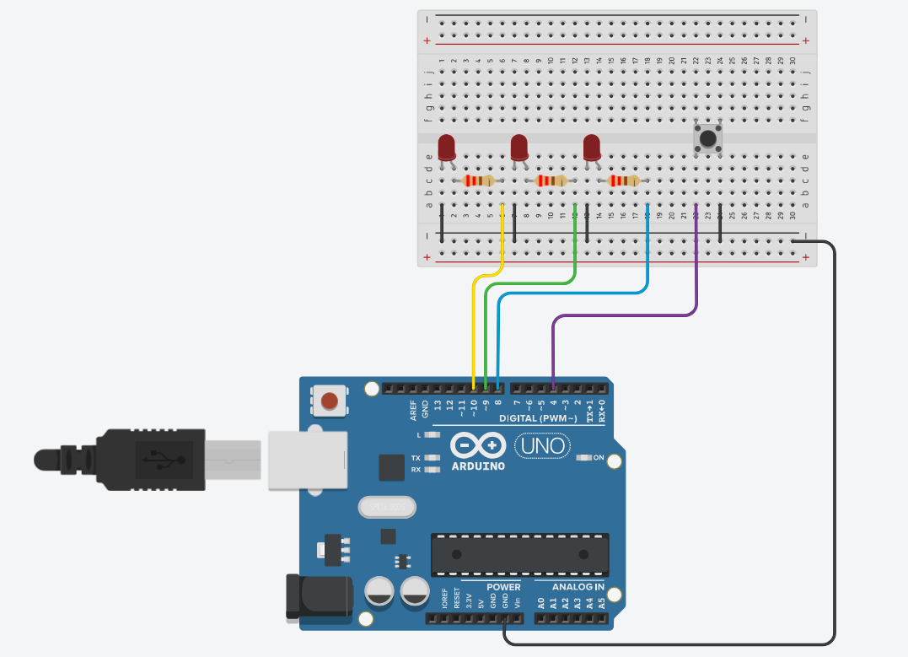

# FSM LED Patterns (Arduino)

This project demonstrates a finite state machine (FSM) controlling 3 LEDs using a single button. Each button press cycles through predefined LED modes.

---

## 🎯 Functionality

- **Button** connected to pin `4` using `INPUT_PULLUP`
- **LEDs** connected to pins `8`, `9`, and `10`
- Button press cycles through the following 4 modes:

| Mode | Description                    |
|------|--------------------------------|
| 0    | All LEDs OFF                  |
| 1    | All LEDs ON                   |
| 2    | All LEDs BLINK together       |
| 3    | LED slide effect (one by one) |

---

## 🧠 Concepts Used

- Finite State Machine (`switch-case`)
- Debounce logic using `delay(50)`
- Non-blocking timing with `millis()`
- Edge detection (`HIGH` to `LOW`)
- Modular code structure (`blink()`, `slide()`)

---
## 🖼️ Wiring Diagram

---

## 💡 Notes

- Uses `INPUT_PULLUP`, so button reads `LOW` when pressed
- FSM state stored in `buttonPushCounter`
- Modular design allows for easy expansion of modes
