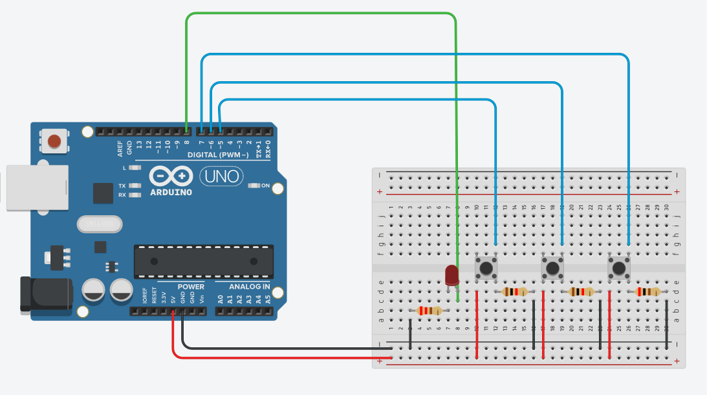

# Toggle LED – 3 Modes with Button Input

This project uses 3 push buttons to control the behavior of a single LED on an Arduino board.

---
## 🖼️ Wiring Diagram

---

## 🎯 Functionality

| Button | Mode   | Description                       |
|--------|--------|-----------------------------------|
| 5      | ON     | LED stays constantly ON           |
| 6      | BLINK  | LED blinks at 250ms interval      |
| 7      | OFF    | LED turns OFF                     |

---

## 🔧 Wiring

- LED anode → Pin 8  
- LED cathode → 220Ω resistor → GND  
- Button 1 (ON) → Pin 5  
- Button 2 (BLINK) → Pin 6  
- Button 3 (OFF) → Pin 7  
- All buttons connected with pull-down resistors (or use INPUT_PULLUP and GND wiring)

---

## 💡 Notes

- `modeState` variable tracks the current mode  
- Blink logic uses `millis()` for non-blocking timing  
- Implemented using a `switch-case` structure  